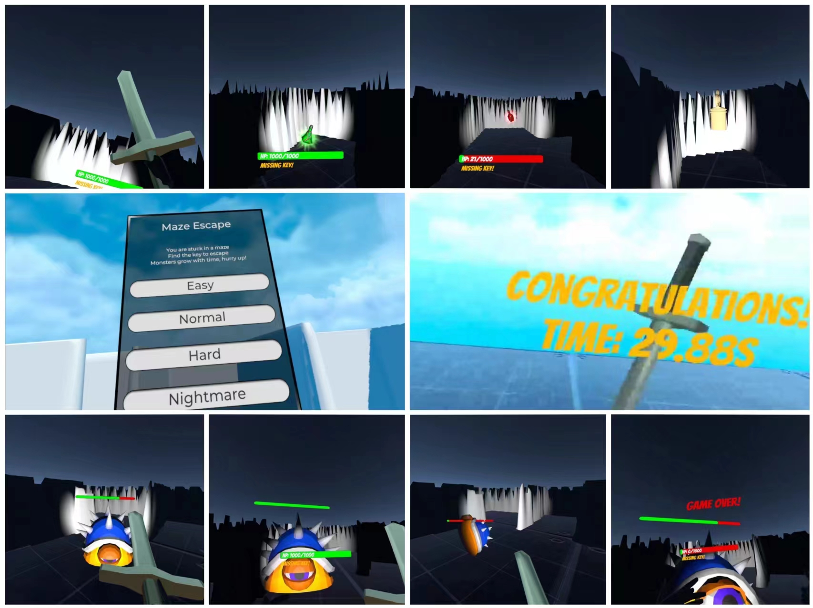

# Maze Escape

## 开发环境

Unity 2022.3.12f1c1

## 测试设备

Oculus Quest2 VR一体机

## 玩法介绍

1. 你很不幸被困在怪物占领的迷宫中，找到***钥匙***，然后寻找***出口***逃离。

2. 没有钥匙时会在视线中出现***缺少钥匙***的提示，没有钥匙在出口会被拦截。

3. 迷宫中有***怪物***

   踏入怪物感知范围后进入***警戒状态***，BGM被更改为战斗音乐

   进一步靠近会被怪物发现，随即进入***追击状态***，向玩家冲过来

   靠近玩家时进入***进攻状态***，立即发动攻击，基于怪物攻击力对玩家造成HP伤害。

   被玩家击杀后进入***死亡状态***，抽搐2s后死亡。

4. 玩家在视角下方有自身血条显示，HP为0时***死亡***，游戏失败。

5. 在迷宫中能够拾取到***宝剑***，可以用来砍怪物。

6. 宝剑对怪物造成的伤害由两部分构成，宝剑的***固有伤害***和玩家的***力度加成***，越用力砍怪造成的伤害越高。

7. 宝剑砍到怪物后怪物会***反弹攻击***，对玩家施加反向推力。

8. 怪物的壳非常坚硬，对它发动攻击次数过多后宝剑会***损毁***，需要注意使用次数，***耐久值***为8次砍击。

9. 在迷宫中能够找到特殊作用的药水

   ***绿色药水***有移动速度加成，能够更好地甩开怪物追击。

   ***红色药水***回复HP，满血时不触发回复效果。

10. 游戏分为***Easy***，***Normal***，***Hard***，***Nightmare***四个难度，逐渐增大迷宫地形***复杂程度***和***怪物数量***

    ***Hard***和***Nightmare***模式下怪物可以***穿墙***

    ***Nightmare***模式下每隔30秒会在场地中随机位置***新出生***一只怪物。

9. 游戏有***时间记录***，怪物会随着时间不断***长大***，长大后***增加血量，增大体型，增大攻击力，扩展警戒范围，扩展攻击范围***，长时间后会难以击杀，在更短的时间逃离迷宫吧。

## 操作指南

左滑杆：移动位置

右滑杆：旋转视角

左右trigger键：手柄对准宝剑后拾取（可隔空拾取），放开按键宝剑自动掉落

左start键：退出当前关卡

右reserve键：退出游戏

## 关卡地图

## 游戏截图

## DEMO

在根目录下的demo.mp4
